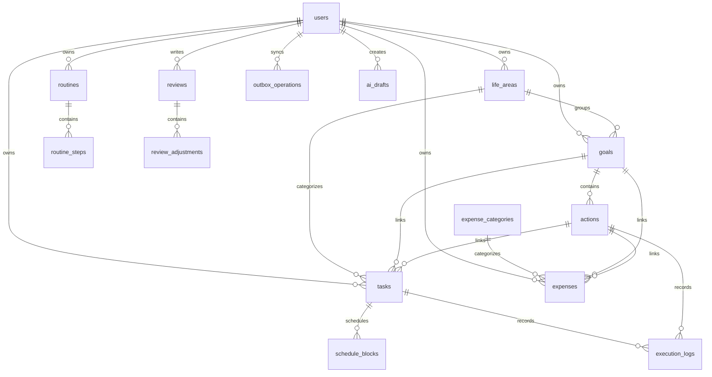

# Livefil 数据库设计文档

> 版本：v0.3  
> 数据库：PostgreSQL  
> ORM：Drizzle  
> 日期：2026-09-24  
> 变更：v0.2 追加 §4.18 同步勘误（SYNC-000 / PD-20260923-003）：增量拉取游标与安全滞后窗口、墓碑传递分类、push 幂等唯一落点与服务端 outbox 不落地、两端命名消歧  
> 变更：v0.3 追加 §4.18.3 勘误（Phase 5 交付 / RD-20260923-003）：更正 §4.18.1（3）墓碑分类表中 `life_areas` / `goals` 的归属（实为无删除语义），更正 §4.18.1（4）「`tasks` 已有索引」的表述（实为 `(user_id, status, updated_at)`，不可支撑 keyset），并登记实际新增的 keyset 索引  
> 关联：[概要设计说明书](./概要设计说明书.md)

## 1. 设计原则

- 每张业务表必须有 `id`、`user_id`、`created_at`、`updated_at`；适用时增加 `deleted_at` 和 `version`。
- 主键使用 UUID，避免跨设备创建数据时发生冲突。
- 时间使用 UTC 存储；同时保存用户时区或使用用户配置解释本地时间。
- 金额使用最小货币单位整数或 PostgreSQL `numeric`，禁止浮点。
- 用户数据通过 `user_id` 隔离。
- 删除优先软删除；后台物理清理由独立任务完成，并先备份。
- 执行记录和审计记录采用追加式设计。

## 2. ER 图



> **审计事件不建表**：早期 ER 图曾画有 `audit_events`，Phase 2 落地时按 SRS §6.7
> 定型为结构化日志的 `audit` 通道（`src/shared/telemetry/audit-event.ts`）——SRS 只要求
> 事件类型、时间、结果、匿名用户标识与版本，未要求关系化存储；保留期（90 天）与归档、
> 导出策略随 OPS 批次。因此此处不再保留该实体，避免「图里有、库里无」。

## 3. 公共字段规范

| 字段 | 类型 | 说明 |
|---|---|---|
| `id` | `uuid` | 客户端可提前生成，跨设备唯一 |
| `user_id` | `uuid` | 所有权归属 |
| `created_at` | `timestamptz` | UTC 创建时间 |
| `updated_at` | `timestamptz` | UTC 修改时间 |
| `deleted_at` | `timestamptz nullable` | 软删除时间 |
| `version` | `bigint` | 乐观并发版本 |

## 4. 核心表

### 4.1 users

| 字段 | 类型 | 约束 |
|---|---|---|
| `id` | `uuid` | PK |
| `email` | `citext`/`varchar` | 云端模式可选，唯一 |
| `display_name` | `varchar(80)` | 可空 |
| `mode` | `varchar(16)` | `local` / `cloud` |
| `locale` | `varchar(16)` | 默认 `zh-CN` |
| `timezone` | `varchar(64)` | 默认由用户确认 |
| `currency_code` | `char(3)` | 默认 `CNY` |
| `week_starts_on` | `smallint` | 0–6 |
| `reminder_enabled` | `boolean` | 默认 true |
| `quiet_hours_start` | `time` | 可空 |
| `quiet_hours_end` | `time` | 可空 |
| `default_task_duration_minutes` | `integer` | 可空（>0），IAM-002 默认值 |
| `default_buffer_minutes` | `integer` | 可空（≥0） |
| `ai_enabled` | `boolean` | 默认 false |
| `ai_data_consent` | `boolean` | 默认 false；开启 AI 前必须为 true |
| `version` | `bigint` | NOT NULL，默认 1，PATCH /me 乐观并发（见公共字段 §3） |
| `created_at` | `timestamptz` | NOT NULL |
| `updated_at` | `timestamptz` | NOT NULL |

> users 表不设 `deleted_at`：账户删除随 data-management 批次（含云端模式）实施，届时按「加列迁移」补。

索引：`unique(email)`、`mode`。

### 4.2 life_areas

| 字段 | 类型 | 约束 |
|---|---|---|
| `id` | `uuid` | PK |
| `user_id` | `uuid` | FK users |
| `name` | `varchar(60)` | NOT NULL |
| `color_key` | `varchar(32)` | 语义色 key，不保存前端色值 |
| `sort_order` | `integer` | NOT NULL |
| `is_default` | `boolean` | NOT NULL |
| `is_archived` | `boolean` | NOT NULL |
| 公共字段 |  |  |

约束：同一用户未归档领域名称唯一。

### 4.3 goals

| 字段 | 类型 | 约束 |
|---|---|---|
| `id` | `uuid` | PK |
| `user_id` | `uuid` | FK users |
| `life_area_id` | `uuid` | 可空 FK（2026-09-21 冻结） |
| `name` | `varchar(160)` | NOT NULL |
| `reason` | `text` | 可空，敏感内容不进日志 |
| `status` | `varchar(24)` | active/completed/paused/abandoned |
| `start_date` | `date` | 可空 |
| `target_date` | `date` | 可空 |
| `result_metric` | `jsonb` | 可空，结构见下（SRS FR-023） |
| `version` | `bigint` | NOT NULL |
| 公共字段 |  |  |

`result_metric` 冻结为最小结构（Phase 3 起可经 PATCH `/goals` 手动更新）：

```json
{ "current": 3, "target": 5, "unit": "次", "note": "以本周实际运动为准" }
```

- `current` / `target`：数值，可空；同时给出时服务端可顺带返回 `current/target` 比值，
  但该比值**只是展示**，不参与任何"目标已实现"的自动判定（SRS FR-023）。
- `unit`：短文本可空；`note`：一句话可空，按敏感内容对待、不进日志。
- 这是「结果进度」，与由执行记录汇总的「行动完成进度」分别存储、分别展示，
  不得互相覆盖。字段增减须规范升版。

### 4.4 actions

| 字段 | 类型 | 约束 |
|---|---|---|
| `id` | `uuid` | PK |
| `user_id` | `uuid` | FK users |
| `goal_id` | `uuid` | FK goals |
| `name` | `varchar(160)` | NOT NULL |
| `minimum_version` | `varchar(160)` | 可空 |
| `target_frequency` | `jsonb` | 可空 |
| `estimated_minutes` | `integer` | > 0 或 NULL |
| `status` | `varchar(24)` | active/completed/paused |
| 公共字段 |  |  |

> 行动删除（2026-09-21 冻结）：经 `DELETE /actions/{actionId}` 软删（`deleted_at`）。
> 有关联任务时在**同一事务**把 tasks.action_id 置空（tasks.goal_id 保留、任务行不删）；
> 不采用「有关联即拒绝」。

### 4.5 tasks

| 字段 | 类型 | 约束 |
|---|---|---|
| `id` | `uuid` | PK |
| `user_id` | `uuid` | FK users |
| `life_area_id` | `uuid` | 可空 FK |
| `goal_id` | `uuid` | 可空 FK |
| `action_id` | `uuid` | 可空 FK |
| `title` | `varchar(240)` | NOT NULL |
| `status` | `varchar(24)` | inbox/planned/in_progress/completed/partial/deferred/skipped/archived |
| `estimated_minutes` | `integer` | > 0 或 NULL |
| `minimum_version` | `varchar(160)` | 可空 |
| `due_date` | `date` | 可空 |
| `recurrence_rule` | `jsonb` | 可空，结构见下（Phase 4 起启用） |
| `template_id` | `uuid` | 可空 FK tasks；物化实例溯源（Phase 4 起启用） |
| `source` | `varchar(24)` | manual/ai/import/recurrence |
| `version` | `bigint` | NOT NULL |
| 公共字段 |  |  |

索引：`(user_id, status, updated_at)`、`(user_id, due_date)`、`(user_id, deleted_at)`。

状态与 SRS §9.1「任务状态流转」对照（流转合法性以该图为准，这里只做枚举映射）：

| SRS 中文 | DB 枚举 | 说明 |
|---|---|---|
| 收件箱 / 未开始 | `inbox` | 快速创建默认态 |
| 已安排 | `planned` | 有 `due_date` 或被安排后进入 |
| 进行中（可选） | `in_progress` | SRS 标注可选 |
| 完成 | `completed` | 含「最低版本完成」——不单列枚举值 |
| 部分完成 | `partial` | 可带实际完成量 / 实际时长 |
| 延期 | `deferred` | 重新安排后回 `planned` |
| 跳过 | `skipped` |  |
| 已归档 | `archived` | 软归档，行保留 |
| 已删除 | （无状态值） | 置 `deleted_at` |

> 「最低版本完成」不单设枚举值：它是「以最低版本完成」这一**完成方式**，落为
> `completed` 并在状态事件里记录执行的是 `minimum_version`；否则状态集会与
> `completed` 永久重叠。延期不是删除，重新打开已完成任务同理，均须留下状态事件
> （经 `audit` 日志通道；持久化的执行/调整历史自 Phase 4 起由 `execution_logs` 承接）。

**完整合法流转表（2026-09-21 冻结；SRS §9.1 只画了正向，此处补齐反向/重开）：**

```text
inbox       → planned | archived
planned     → in_progress | completed | partial | deferred | skipped | archived
in_progress → planned | completed | partial | deferred | skipped | archived
completed   → planned（重开，留状态事件）| archived
partial     → in_progress | planned | completed | deferred | skipped | archived
deferred    → planned（SRS：重新安排）| archived
skipped     → planned（重新捡回）| archived
archived    → inbox | planned（恢复，调用方指定）
```

- 删除不经状态：任意态经 `DELETE /tasks/{id}` 置 `deleted_at`。
- 上表之外的跳转一律 `VALIDATION_ERROR`；inbox 不允许直接进 in_progress
  （SRS 要求先「已安排」）。

**重复规则与物化（2026-09-21 冻结，Phase 4 启用）：**

`recurrence_rule` 冻结为最小结构（RRULE 子集；字段增减须规范升版）：

```json
{ "freq": "weekly", "interval": 1, "weekdays": [1, 2, 3, 4, 5], "endsOn": "2026-12-31" }
```

- `freq`：必填，`daily` | `weekly`；`interval`：正整数，缺省 1。
- `weekdays`：0–6（0＝周日）；`weekly` 时必填且非空，`daily` 时不允许给出。
- `endsOn`：可选日历日，该日之后不再展开。

物化口径（决策：实例物化、不做虚拟展开）：

- 带 `recurrence_rule` 的任务是**模板**；展开在窗口内生成实例行：
  `template_id` 指向模板、`recurrence_rule` 为 null、`status` 初始 `planned`、
  `source='recurrence'`，每个命中日期一行。
- 唯一约束：`(user_id, template_id, due_date)`，展开幂等（不先查后插，靠约束冲突）。
- 展开由应用服务在显式「安排」及日/周查询（含 `GET /today`、`GET /tasks` 带
  `from/to`）窗口内调用，窗口外不预生成。
- **改当前实例**：PATCH 实例行（普通乐观并发），与模板无关。
- **改未来规则**：PATCH 模板的 `recurrence_rule`；既有实例行不级联、不重写
  （规则变更不篡改历史实例，SRS FR-033）；UI 必须先询问「当前一次 / 未来所有」。
- 删除模板仅软删模板，实例行保留。

### 4.6 schedule_blocks

| 字段 | 类型 | 约束 |
|---|---|---|
| `id` | `uuid` | PK |
| `user_id` | `uuid` | FK users |
| `task_id` | `uuid` | 可空 FK |
| `action_id` | `uuid` | 可空 FK |
| `routine_id` | `uuid` | 可空 FK routines（例程展开，Phase 4 起启用） |
| `routine_step_id` | `uuid` | 可空 FK routine_steps（Phase 4 起启用） |
| `starts_at_utc` | `timestamptz` | NOT NULL |
| `ends_at_utc` | `timestamptz` | NOT NULL |
| `timezone` | `varchar(64)` | NOT NULL |
| `source` | `varchar(24)` | manual/suggested/imported/routine |
| `status` | `varchar(24)` | planned/active/completed/adjusted/cancelled |
| `conflict_state` | `varchar(24)` | none/warning/confirmed |
| `version` | `bigint` | NOT NULL |
| 公共字段 |  |  |

约束：`ends_at_utc > starts_at_utc`。索引：`(user_id, starts_at_utc, ends_at_utc)`。

状态语义（2026-09-21 冻结）：

- `planned`：已排入；`active`：进行中；`adjusted`：被移动/改过时长；
  `cancelled`：取消（DELETE 端点的终态）。
- 时间块与任务状态**不隐式联动**：移动/取消块不改任务状态；标记完成时由
  应用层追加一条 `execution_logs`，任务按该记录状态走 §4.5 流转矩阵
  （见《接口文档》§6）。无 `task_id` 的自由块独立闭环。

### 4.7 routines 与 routine_steps

`routines` 保存例程定义；`routine_steps` 保存例程步骤和顺序。

`routines`：

| 字段 | 类型 | 约束 |
|---|---|---|
| `id` | `uuid` | PK |
| `user_id` | `uuid` | FK users |
| `life_area_id` | `uuid` | 可空 FK life_areas |
| `name` | `varchar(160)` | NOT NULL |
| `recurrence_rule` | `jsonb` | NOT NULL，结构同 §4.5 最小规则（daily/weekly） |
| `anchor_time` | `varchar(5)` | 可空，`HH:MM` 本地时间；安排例程时各步顺序展开的默认起点 |
| `timezone` | `varchar(64)` | NOT NULL，规则与锚点的解释时区 |
| `version` | `bigint` | NOT NULL |
| 公共字段 |  |  |

`routine_steps`：

| 字段 | 类型 | 约束 |
|---|---|---|
| `id` | `uuid` | PK |
| `user_id` | `uuid` | FK users |
| `routine_id` | `uuid` | NOT NULL FK routines |
| `title` | `varchar(240)` | NOT NULL |
| `position` | `integer` | NOT NULL，从 0 开始连续 |
| `estimated_minutes` | `integer` | > 0 或 NULL |
| `minimum_version` | `varchar(160)` | 可空 |
| `version` | `bigint` | NOT NULL |
| 公共字段 |  |  |

约束：

- 同一例程内 `(routine_id, position)` 唯一且从 0 开始连续。
- 「安排例程到某日」：按 `position` 顺序，以当日起点时间（`anchor_time`
  或用户指定）逐步行进，每个步骤生成一个 `schedule_blocks` 行
  （`source='routine'`，回填 `routine_id/routine_step_id`）；步骤间不加隐式缓冲。
- 改当前实例＝编辑当天已生成的块；改未来规则＝PATCH 例程定义与步骤模板，
  已生成的块不重写（不篡改历史）。删除例程软删模板，已生成块保留。

### 4.8 execution_logs

| 字段 | 类型 | 约束 |
|---|---|---|
| `id` | `uuid` | PK |
| `user_id` | `uuid` | FK users |
| `task_id` | `uuid` | 可空 FK |
| `action_id` | `uuid` | 可空 FK |
| `schedule_block_id` | `uuid` | 可空 FK |
| `status` | `varchar(24)` | NOT NULL，枚举见下 |
| `planned_minutes` | `integer` | 可空 |
| `actual_minutes` | `integer` | >= 0 或 NULL |
| `reason_code` | `varchar(40)` | 可空，取值复用任务冻结五值（见下） |
| `note` | `text` | 可空，不进普通日志 |
| `energy_level` | `varchar(16)` | 可空，`low`/`medium`/`high` |
| `mood_score` | `smallint` | 可空，整数 1–5 |
| `occurred_at` | `timestamptz` | NOT NULL，事情实际发生时刻（用户可回填补记） |
| `created_at` | `timestamptz` | NOT NULL，记录落库时刻；与 `occurred_at` 分离 |

索引：`(user_id, occurred_at)`、`(user_id, task_id, occurred_at)`。

口径（2026-09-21 冻结，三处矛盾在此定档）：

- `status` 五枚举：`completed`（完成）/ `minimum_completed`（最低版本完成）/
  `partial`（部分完成）/ `deferred`（延期）/ `skipped`（跳过）。
- 注意区分：tasks.status 仍是八枚举、**最低版本不单列**（落 `completed`，
  由本条 execution_logs 记 `minimum_completed` 表达）。
- `reason_code` 复用冻结集合：`NO_ENERGY` / `NO_TIME` / `CONFLICT` /
  `TOO_HARD` / `NOT_IN_MOOD`；仅 partial/deferred/skipped 可带。
- 本表追加式、无 `version`；补记/修改经新增记录表达，不原地改。

### 4.9 expense_categories

| 字段 | 类型 | 约束 |
|---|---|---|
| `id` | `uuid` | PK |
| `user_id` | `uuid` | FK users |
| `name` | `varchar(60)` | NOT NULL |
| `is_default` | `boolean` | NOT NULL |
| `is_archived` | `boolean` | NOT NULL |
| 公共字段 |  |  |

### 4.10 expenses

| 字段 | 类型 | 约束 |
|---|---|---|
| `id` | `uuid` | PK |
| `user_id` | `uuid` | FK users |
| `category_id` | `uuid` | FK expense_categories |
| `life_area_id` | `uuid` | 可空 FK |
| `goal_id` | `uuid` | 可空 FK |
| `action_id` | `uuid` | 可空 FK |
| `amount_minor` | `bigint` | > 0 |
| `currency_code` | `char(3)` | NOT NULL |
| `occurred_on` | `date` | NOT NULL |
| `payment_method` | `varchar(40)` | 可空 |
| `note` | `text` | 可空，不进普通日志 |
| `source` | `varchar(24)` | manual/ai_draft/import |
| `version` | `bigint` | NOT NULL |
| 公共字段 |  |  |

索引：`(user_id, occurred_on)`、`(user_id, category_id, occurred_on)`、`(user_id, goal_id)`。

### 4.11 reviews 与 review_adjustments

`reviews` 保存某日或某周的复盘；`review_adjustments` 保存用户确认的保留、缩小、延期、暂停和删除动作。

复盘内容可包含结构化快照，必须带 schema 版本，不能依赖未来实时重新计算才能展示历史。

### 4.12 notification_rules 与 notification_deliveries

规则保存用户偏好，发送记录保存状态：pending、sent、failed、cancelled。

发送失败必须记录错误码和下一次重试时间，不在无上限情况下重试。

### 4.13 ai_drafts 与 ai_usage

`ai_drafts`：

- `id`
- `user_id`
- `draft_type`
- `input_hash`
- `sanitized_input`
- `result_json`
- `status`: pending/confirmed/cancelled/expired/failed
- `provider`
- `model`
- `expires_at`
- 公共字段

`ai_usage`：

- `user_id`
- `provider`
- `model`
- `request_type`
- `input_tokens`/`output_tokens`，若供应商提供
- `estimated_cost_minor`
- `status`
- `created_at`

普通日志不保存完整输入和输出内容。

### 4.14 outbox_operations 与 sync_conflicts

`outbox_operations` 保存客户端提交操作：

- `operation_id`
- `user_id`
- `entity_type`
- `entity_id`
- `operation_type`
- `payload_json`
- `client_created_at`
- `idempotency_key`
- `status`
- `retry_count`
- `last_error_code`
- `processed_at`

`sync_conflicts` 保存无法自动解决的冲突：

- `id`
- `user_id`
- `entity_type`
- `entity_id`
- `local_version`
- `server_version`
- `local_payload_json`
- `server_payload_json`
- `status`
- `resolved_at`

### 4.15 idempotency_keys

写操作幂等识别表（2026-09-21 新增，Phase 3 迁移；支撑接口文档 §1.1 的
`Idempotency-Key`，Phase 5 同步直接复用，与 outbox 的幂等列不重复——
outbox 只记同步链路，这张表覆盖全部写请求）。

| 字段 | 类型 | 约束 |
|---|---|---|
| `id` | `uuid` | PK |
| `user_id` | `uuid` | FK users |
| `key` | `varchar(128)` | NOT NULL，客户端给定的幂等键 |
| `request_hash` | `varchar(64)` | NOT NULL，请求体指纹；同 key 不同指纹视为冲突 |
| `response_snapshot` | `jsonb` | 可空，首次成功响应的快照，重放时原样返回 |
| `status` | `varchar(16)` | processing/completed |
| 公共字段 |  | 不含 `deleted_at` |

- 唯一约束：`(user_id, key)`；索引另含 `(created_at)` 供过期清理。
- 首次请求先占行（processing），同 key 的并发/重试请求不重复执行：
  已完成者重放快照（错误码 `IDEMPOTENCY_REPLAY`），处理中并发请求等待/冲突。
  同 key 但 `request_hash` 不同返回 `VALIDATION_ERROR`。
- 键的留存与清理策略随 OPS 批次（不提前删）。

### 4.16 fixed_commitments

固定事项（工作排班、会议、硬约等不可自由挪动的时间），2026-09-21 新增、
Phase 4 迁移；归属 scheduling 模块（不新增业务模块）。是 FR-030 今日视图、
FR-031 冲突检测的对象。

| 字段 | 类型 | 约束 |
|---|---|---|
| `id` | `uuid` | PK |
| `user_id` | `uuid` | FK users |
| `title` | `varchar(240)` | NOT NULL |
| `template_id` | `uuid` | 可空自 FK；重复固定事项的实例溯源 |
| `local_date` | `date` | 实例行 NOT NULL（归属日历日）；模板行 NULL |
| `starts_at_utc` | `timestamptz` | 实例行 NOT NULL |
| `ends_at_utc` | `timestamptz` | 实例行 NOT NULL |
| `starts_at_local` | `varchar(5)` | 模板行 NOT NULL，`HH:MM` 本地钟点；实例行 NULL |
| `duration_minutes` | `integer` | NOT NULL，> 0 |
| `timezone` | `varchar(64)` | NOT NULL；UTC 按日解释本地钟点（DST 安全） |
| `recurrence_rule` | `jsonb` | 可空，结构同 §4.5（daily/weekly）；非空即模板 |
| `version` | `bigint` | NOT NULL |
| 公共字段 |  |  |

- 约束：实例行 `ends_at_utc > starts_at_utc`；
  唯一 `(user_id, template_id, local_date)`，展开幂等。
- 索引：`(user_id, local_date)`、`(user_id, starts_at_utc, ends_at_utc)`。
- 三种形态：单次事项（rule/template 均空、UTC 给定）；重复模板
  （`recurrence_rule` 非空、`starts_at_local`+`duration_minutes`）；
  重复实例（`template_id` 非空、UTC 按当日 DST 换算）。
- 物化口径同 §4.5 任务实例：查询窗口内由应用服务展开，改模板不重写历史实例，
  UI 区分「当前一次 / 未来所有」；删除模板软删、实例保留。
- 冲突检测覆盖本表：与 `schedule_blocks` 的重叠视为冲突（相邻不撞）。

### 4.17 recovery_states

恢复模式手动态（2026-09-21 新增，Phase 4 迁移）；自动提示不落库、
由 `/today` 现算（口径见《接口文档》§7）。

| 字段 | 类型 | 约束 |
|---|---|---|
| `user_id` | `uuid` | PK，FK users（每用户至多一行） |
| `enabled` | `boolean` | NOT NULL |
| `since` | `timestamptz` | NOT NULL，进入当前手动态的时刻 |
| `created_at` / `updated_at` | `timestamptz` | NOT NULL |

不含 `deleted_at`、`version`（单行 upsert，主键即并发口径）。

### 4.18 同步勘误（2026-09-23，SYNC-000 / PD-20260923-003）

依据 PD-20260923-001 终审口径（本地单用户 × 多设备同步）与 SYNC-000 技术 spike
结论补充；**不改变 §4.14/§4.15 原文**，冲突处以本节为准。

#### 4.18.1 增量拉取游标：per-entity 变更时刻扫描，不新增 change-log 表

**结论**：Phase 5 的 `GET /sync/pull` 采用**既有业务表上的变更时刻扫描**，
游标为复合键 `(changeAt, id)`，其中：

```text
changeAt = coalesce(updated_at, created_at)
```

- `updated_at` 由公共字段的 `$onUpdate` 维护（§3）；追加式表（`execution_logs`，
  §4.8）无 `updated_at`、无更新路径，故以其 `created_at` 作为变更时刻——对
  该表而言 `created_at` 就是唯一的变更时刻。
- **不新增 change-log 表**：单用户、单写入端（本人多设备）场景下变更量小，
  change-log 带来「写入路径双写 + 表膨胀 + 清理策略」三项长期成本，而其解决的
  「全局单调游标」问题在本方案下已可解决（见下）。

**（1）为什么游标必须复合 `id`**：`updated_at` 由应用侧 `new Date()` 生成，
同一毫秒可重复，单独一列不构成全序。按 `(changeAt, id)` 升序 keyset 分页，
才能保证不重不漏。

**（2）同刻并发写入的漏读与安全滞后窗口（本方案的正确性前提）**：
PG 的行在事务**提交后**才可见，而 `changeAt` 记录的是**语句执行时刻**。若事务 A
在 T1 取时刻、T2 才提交，而事务 B 取到更晚时刻且在 T2 之前提交，则拉取方在
T2 之前拉到 B 并把游标推进到 B 的时刻；A 提交后其 `changeAt = T1` 已落在游标
之后 → **A 永远拉不到**。

解法：服务端施加**安全滞后窗口**——pull 只返回 `changeAt <= now() - lag`，
`lag` 默认 5 秒（可配）。前提是 `lag > 最长写事务时长`。代价是变更最多延迟
`lag` 秒可见（单用户多设备场景可接受）。

**这是唯一的正确性前提**：实现中必须把它落为查询条件，并有测试覆盖
（构造「后提交但 changeAt 更早」的场景，断言仍能拉到）。

**（3）墓碑在 pull 链路的传递**：按现网各表的删除形态分四类处理，**无需新增墓碑表**：

| 形态 | 涉及表 | pull 传递方式 |
|---|---|---|
| 软删（有 `deleted_at`） | `life_areas` / `goals` / `actions` / `tasks` / `routines` / `routine_steps` / `fixed_commitments` | 软删是一次 UPDATE，`changeAt` 随之前进，该行自然出现在增量流；`deleted_at` 非空即墓碑，客户端据此清理本地行 |
| 状态标记取消（无 `deleted_at`） | `schedule_blocks`（`status = cancelled`） | 同为 UPDATE 语义，天然在流内 |
| 追加式不可删 | `execution_logs` | 无更新与删除路径，无需墓碑 |
| 级联硬删 | `routine_steps` 随 `routines` 级联、外键 `onDelete: cascade` | **存在墓碑缺口**：级联硬删不产生子行变更。客户端按「父级墓碑级联清理」处理（本地同事务删除子行），不依赖子行墓碑 |

另：`users` 明确不设 `deleted_at`（§4.1），不参与本批同步；`idempotency_keys`
与 `sync_conflicts` 为服务端内部表，不进入 pull 结果。

**要求**：所有写路径（含软删、取消）必须经 Drizzle `update()` 使 `changeAt`
前进；任何绕过 `$onUpdate` 的原生 SQL 更新都会造成客户端漏读。

**（4）索引**：keyset 扫描需 `(user_id, changeAt, id)` 索引支撑。`tasks` 已有
`tasks_user_status_updated_idx`，其余表在 Phase 5 迁移中按需评估补索引。

**回退方式**：若 Phase 5 验收中出现「滞后窗口仍漏读」或跨表 UNION 性能不达标，
升级为 change-log 表（`change_events(user_id, entity_type, entity_id, change_at, seq)`，
写入路径同事务双写），pull 只扫单表、游标退化为单调 `seq`。该回退**不改变客户端
协议**（游标仍是不透明字符串），故可后置决策。

#### 4.18.2 push 幂等：唯一落点为 `idempotency_keys`，服务端 outbox 不落地

**结论**：

- 幂等判定的**唯一落点**是 `idempotency_keys`（§4.15）：`key = "sync:" + operationId`，
  `request_hash = sha256(entityType | entityId | operationType | payload)`。
  与 §4.15 原文「Phase 5 同步直接复用」一致。
- **§4.14 的 `outbox_operations` 在 Phase 5 不落地**。理由：其列
  （`idempotency_key` / `status` / `retry_count` / `processed_at`）与
  `idempotency_keys`（`key` / `status` / `response_snapshot`）职责重叠，二者并存
  会形成「两个地方都能判定是否已处理」的双真相源，与 §4.15 原文
  「与 outbox 的幂等列不重复」的原则冲突。**该表定义保留**，待后续引入服务端
  操作审计或自动重试需求时再启用（启用不改变客户端协议）。
- `sync_conflicts`（§4.14）**照常落地**，职责无重叠。
- **命名消歧**：`outbox` 一词在两端含义不同，改为两端不同名：

| 位置 | 名称 | 归属 |
|---|---|---|
| 客户端 IndexedDB（详细设计 §5.1） | `pending_operations`（原称 `outbox_operations`） | 客户端待同步队列，私有结构，不同步给服务端 |
| 服务端表（本节 §4.14） | `outbox_operations`（名称保留，Phase 5 不启用） | 服务端侧操作记录（预留） |

**回退方式**：如需服务端审计/重试，在 push 成功路径的同事务内写入 §4.14 的
`outbox_operations`；幂等判定仍留在 `idempotency_keys`，故不构成协议变更。

#### 4.18.3 勘误追加（2026-09-24，Phase 5 交付 / RD-20260923-003）

> 本节**不修改** §4.18.1 的原文，仅就其中两处与现网 schema 不符的表述作事实更正。
> 两处均经 PD-20260923-004 裁定（第 2、3 项，最终决策者 2026-09-23 拍板确认），
> 实现已按更正后的口径落地。

**一、更正 §4.18.1（3）墓碑传递四分类表的「软删」行**

原文把 `life_areas` 与 `goals` 列入「软删（有 `deleted_at`）」类，与现网不符：

- `goals`（`drizzle/schema.ts` §4.3）**没有 `deleted_at` 列**：目标的生命周期是
  `active/completed/paused/abandoned`，**不存在删除路径**。
- `life_areas`（§4.2）虽有 `deleted_at` 列，但**没有任何写入路径**——IAM-003 冻结
  「归档＝置 `is_archived`，不删行」，仓储实现只读写 `isArchived`。该列恒为 NULL。

因此这两张表的 pull 墓碑判据是**恒为 false**（`deleted` 恒 `false`），其状态变更
（目标的 `status`、生活领域的 `is_archived`）只经 `payload` 传递，不经墓碑。更正后的
分类表为：

| 形态 | 涉及表 | pull 传递方式 |
|---|---|---|
| 软删（有 `deleted_at` 且有写入路径） | `actions` / `tasks` / `routines` / `routine_steps` / `fixed_commitments` | `deleted_at` 非空即墓碑 |
| 状态标记取消（无 `deleted_at`） | `schedule_blocks`（`status = cancelled`） | 状态即墓碑 |
| 追加式不可删 | `execution_logs` | 无墓碑（只读） |
| **无删除语义（本次更正）** | `life_areas`（归档经 `is_archived`）/ `goals`（无删除路径） | `deleted` 恒 `false`，状态经 `payload` 传递 |
| 级联硬删 | `routine_steps` 随 `routines` 级联 | 客户端按父级墓碑级联清理子行 |

**本批不补这两张表的删除路径**——超出 Phase 5 范围，属产品模型层面的后续决策。

**二、更正 §4.18.1（4）的索引表述**

原文称「`tasks` 已有 `tasks_user_status_updated_idx`」，暗示该索引可支撑 keyset 扫描。
**该说法不成立**：现网索引 `tasks_user_status_updated_idx`（`drizzle/schema.ts`）的列是
`(user_id, status, updated_at)`——**第二列是 `status`**，按 `(changeAt, id)` 排序的分页
无法利用它（`status` 既不在游标里也不在排序键上，索引前缀在 equality 条件缺失时断掉）。

故 Phase 5 迁移（`drizzle/0003_*.sql`）实际新增：

| 表 | 新增索引 |
|---|---|
| `life_areas` / `actions` / `tasks` / `goals` / `routines` / `routine_steps` / `fixed_commitments` / `schedule_blocks` | `(user_id, updated_at, id)` |
| `execution_logs` | `(user_id, created_at, id)`（该表无 `updated_at`，变更时刻取 `created_at`） |

其中 `tasks_user_updated_idx (user_id, updated_at, id)` 即本次更正的直接产物。
均为**纯加索引**：不改表结构、不改客户端协议，空库全新迁移与已有数据升级两条路径均可行。

## 5. 约束、索引和权限

### 5.1 用户隔离

所有用户数据表必须带 `user_id`。服务层和数据库策略都要校验用户归属，不能只依赖前端传入的 ID。

### 5.2 金额

- `amount_minor` 使用 `bigint`，例如 36 元存为 3600。
- 不使用浮点运算金额。
- 多币种时必须保留 `currency_code`。
- 汇总前检查币种，不自动混合不同币种。

### 5.3 时间

- 绝对时间使用 `timestamptz`。
- 用户本地日期使用 `date`，不把生日、账单日等强行转 UTC。
- 重复规则保存用户时区解释。

### 5.4 迁移

- 迁移文件纳入版本控制。
- 发布前执行备份和测试库迁移。
- 删除字段采用停止读、停止写、再删除的多阶段策略。
- 批量数据修复必须可回滚并带明确条件。

## 6. 备份和恢复

- 云端数据库每日自动备份。
- 至少保留 7–30 天，具体由服务商和预算决定。
- 重大迁移前手动备份。
- 每月至少进行一次恢复演练。
- 用户可导出 JSON，作为个人层面的额外恢复方式。
