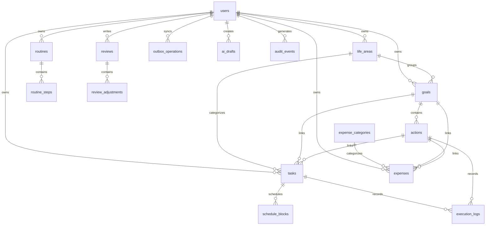

# Livefil 数据库设计文档

> 版本：v0.1  
> 数据库：PostgreSQL  
> ORM：Drizzle  
> 日期：2026-09-15  
> 关联：[概要设计说明书](./概要设计说明书.md)

## 1. 设计原则

- 每张业务表必须有 `id`、`user_id`、`created_at`、`updated_at`；适用时增加 `deleted_at` 和 `version`。
- 主键使用 UUID，避免跨设备创建数据时发生冲突。
- 时间使用 UTC 存储；同时保存用户时区或使用用户配置解释本地时间。
- 金额使用最小货币单位整数或 PostgreSQL `numeric`，禁止浮点。
- 用户数据通过 `user_id` 隔离。
- 删除优先软删除；后台物理清理由独立任务完成，并先备份。
- 执行记录和审计记录采用追加式设计。

## 2. ER 图

## 3. 公共字段规范

| 字段 | 类型 | 说明 |
|---|---|---|
| `id` | `uuid` | 客户端可提前生成，跨设备唯一 |
| `user_id` | `uuid` | 所有权归属 |
| `created_at` | `timestamptz` | UTC 创建时间 |
| `updated_at` | `timestamptz` | UTC 修改时间 |
| `deleted_at` | `timestamptz nullable` | 软删除时间 |
| `version` | `bigint` | 乐观并发版本 |

## 4. 核心表

### 4.1 users

| 字段 | 类型 | 约束 |
|---|---|---|
| `id` | `uuid` | PK |
| `email` | `citext`/`varchar` | 云端模式可选，唯一 |
| `display_name` | `varchar(80)` | 可空 |
| `mode` | `varchar(16)` | `local` / `cloud` |
| `locale` | `varchar(16)` | 默认 `zh-CN` |
| `timezone` | `varchar(64)` | 默认由用户确认 |
| `currency_code` | `char(3)` | 默认 `CNY` |
| `week_starts_on` | `smallint` | 0–6 |
| `reminder_enabled` | `boolean` | 默认 true |
| `quiet_hours_start` | `time` | 可空 |
| `quiet_hours_end` | `time` | 可空 |
| `created_at` | `timestamptz` | NOT NULL |
| `updated_at` | `timestamptz` | NOT NULL |

索引：`unique(email)`、`mode`。

### 4.2 life_areas

| 字段 | 类型 | 约束 |
|---|---|---|
| `id` | `uuid` | PK |
| `user_id` | `uuid` | FK users |
| `name` | `varchar(60)` | NOT NULL |
| `color_key` | `varchar(32)` | 语义色 key，不保存前端色值 |
| `sort_order` | `integer` | NOT NULL |
| `is_default` | `boolean` | NOT NULL |
| `is_archived` | `boolean` | NOT NULL |
| 公共字段 |  |  |

约束：同一用户未归档领域名称唯一。

### 4.3 goals

| 字段 | 类型 | 约束 |
|---|---|---|
| `id` | `uuid` | PK |
| `user_id` | `uuid` | FK users |
| `life_area_id` | `uuid` | FK life_areas |
| `name` | `varchar(160)` | NOT NULL |
| `reason` | `text` | 可空，敏感内容不进日志 |
| `status` | `varchar(24)` | active/completed/paused/abandoned |
| `start_date` | `date` | 可空 |
| `target_date` | `date` | 可空 |
| `result_metric` | `jsonb` | 可空，结构化校验 |
| `version` | `bigint` | NOT NULL |
| 公共字段 |  |  |

### 4.4 actions

| 字段 | 类型 | 约束 |
|---|---|---|
| `id` | `uuid` | PK |
| `user_id` | `uuid` | FK users |
| `goal_id` | `uuid` | FK goals |
| `name` | `varchar(160)` | NOT NULL |
| `minimum_version` | `varchar(160)` | 可空 |
| `target_frequency` | `jsonb` | 可空 |
| `estimated_minutes` | `integer` | > 0 或 NULL |
| `status` | `varchar(24)` | active/completed/paused |
| 公共字段 |  |  |

### 4.5 tasks

| 字段 | 类型 | 约束 |
|---|---|---|
| `id` | `uuid` | PK |
| `user_id` | `uuid` | FK users |
| `life_area_id` | `uuid` | 可空 FK |
| `goal_id` | `uuid` | 可空 FK |
| `action_id` | `uuid` | 可空 FK |
| `title` | `varchar(240)` | NOT NULL |
| `status` | `varchar(24)` | inbox/planned/in_progress/completed/partial/deferred/skipped/archived |
| `estimated_minutes` | `integer` | > 0 或 NULL |
| `minimum_version` | `varchar(160)` | 可空 |
| `due_date` | `date` | 可空 |
| `recurrence_rule` | `jsonb` | 可空 |
| `source` | `varchar(24)` | manual/ai/import |
| `version` | `bigint` | NOT NULL |
| 公共字段 |  |  |

索引：`(user_id, status, updated_at)`、`(user_id, due_date)`、`(user_id, deleted_at)`。

### 4.6 schedule_blocks

| 字段 | 类型 | 约束 |
|---|---|---|
| `id` | `uuid` | PK |
| `user_id` | `uuid` | FK users |
| `task_id` | `uuid` | 可空 FK |
| `action_id` | `uuid` | 可空 FK |
| `starts_at_utc` | `timestamptz` | NOT NULL |
| `ends_at_utc` | `timestamptz` | NOT NULL |
| `timezone` | `varchar(64)` | NOT NULL |
| `source` | `varchar(24)` | manual/suggested/imported |
| `status` | `varchar(24)` | planned/active/completed/adjusted/cancelled |
| `conflict_state` | `varchar(24)` | none/warning/confirmed |
| `version` | `bigint` | NOT NULL |
| 公共字段 |  |  |

约束：`ends_at_utc > starts_at_utc`。索引：`(user_id, starts_at_utc, ends_at_utc)`。

### 4.7 routines 与 routine_steps

`routines` 保存例程定义；`routine_steps` 保存例程步骤和顺序。

关键字段：

- `routines.name`
- `routines.life_area_id`
- `routines.recurrence_rule`
- `routine_steps.title`
- `routine_steps.position`
- `routine_steps.estimated_minutes`
- `routine_steps.minimum_version`

约束：同一例程内 `position` 唯一且从 0 开始连续或可排序。

### 4.8 execution_logs

| 字段 | 类型 | 约束 |
|---|---|---|
| `id` | `uuid` | PK |
| `user_id` | `uuid` | FK users |
| `task_id` | `uuid` | 可空 FK |
| `action_id` | `uuid` | 可空 FK |
| `schedule_block_id` | `uuid` | 可空 FK |
| `status` | `varchar(24)` | NOT NULL |
| `planned_minutes` | `integer` | 可空 |
| `actual_minutes` | `integer` | >= 0 或 NULL |
| `reason_code` | `varchar(40)` | 可空 |
| `note` | `text` | 可空，不进普通日志 |
| `energy_level` | `varchar(16)` | 可空 |
| `mood_score` | `smallint` | 可空，范围校验 |
| `occurred_at` | `timestamptz` | NOT NULL |
| `created_at` | `timestamptz` | NOT NULL |

索引：`(user_id, occurred_at)`、`(user_id, task_id, occurred_at)`。

### 4.9 expense_categories

| 字段 | 类型 | 约束 |
|---|---|---|
| `id` | `uuid` | PK |
| `user_id` | `uuid` | FK users |
| `name` | `varchar(60)` | NOT NULL |
| `is_default` | `boolean` | NOT NULL |
| `is_archived` | `boolean` | NOT NULL |
| 公共字段 |  |  |

### 4.10 expenses

| 字段 | 类型 | 约束 |
|---|---|---|
| `id` | `uuid` | PK |
| `user_id` | `uuid` | FK users |
| `category_id` | `uuid` | FK expense_categories |
| `life_area_id` | `uuid` | 可空 FK |
| `goal_id` | `uuid` | 可空 FK |
| `action_id` | `uuid` | 可空 FK |
| `amount_minor` | `bigint` | > 0 |
| `currency_code` | `char(3)` | NOT NULL |
| `occurred_on` | `date` | NOT NULL |
| `payment_method` | `varchar(40)` | 可空 |
| `note` | `text` | 可空，不进普通日志 |
| `source` | `varchar(24)` | manual/ai_draft/import |
| `version` | `bigint` | NOT NULL |
| 公共字段 |  |  |

索引：`(user_id, occurred_on)`、`(user_id, category_id, occurred_on)`、`(user_id, goal_id)`。

### 4.11 reviews 与 review_adjustments

`reviews` 保存某日或某周的复盘；`review_adjustments` 保存用户确认的保留、缩小、延期、暂停和删除动作。

复盘内容可包含结构化快照，必须带 schema 版本，不能依赖未来实时重新计算才能展示历史。

### 4.12 notification_rules 与 notification_deliveries

规则保存用户偏好，发送记录保存状态：pending、sent、failed、cancelled。

发送失败必须记录错误码和下一次重试时间，不在无上限情况下重试。

### 4.13 ai_drafts 与 ai_usage

`ai_drafts`：

- `id`
- `user_id`
- `draft_type`
- `input_hash`
- `sanitized_input`
- `result_json`
- `status`: pending/confirmed/cancelled/expired/failed
- `provider`
- `model`
- `expires_at`
- 公共字段

`ai_usage`：

- `user_id`
- `provider`
- `model`
- `request_type`
- `input_tokens`/`output_tokens`，若供应商提供
- `estimated_cost_minor`
- `status`
- `created_at`

普通日志不保存完整输入和输出内容。

### 4.14 outbox_operations 与 sync_conflicts

`outbox_operations` 保存客户端提交操作：

- `operation_id`
- `user_id`
- `entity_type`
- `entity_id`
- `operation_type`
- `payload_json`
- `client_created_at`
- `idempotency_key`
- `status`
- `retry_count`
- `last_error_code`
- `processed_at`

`sync_conflicts` 保存无法自动解决的冲突：

- `id`
- `user_id`
- `entity_type`
- `entity_id`
- `local_version`
- `server_version`
- `local_payload_json`
- `server_payload_json`
- `status`
- `resolved_at`

## 5. 约束、索引和权限

### 5.1 用户隔离

所有用户数据表必须带 `user_id`。服务层和数据库策略都要校验用户归属，不能只依赖前端传入的 ID。

### 5.2 金额

- `amount_minor` 使用 `bigint`，例如 36 元存为 3600。
- 不使用浮点运算金额。
- 多币种时必须保留 `currency_code`。
- 汇总前检查币种，不自动混合不同币种。

### 5.3 时间

- 绝对时间使用 `timestamptz`。
- 用户本地日期使用 `date`，不把生日、账单日等强行转 UTC。
- 重复规则保存用户时区解释。

### 5.4 迁移

- 迁移文件纳入版本控制。
- 发布前执行备份和测试库迁移。
- 删除字段采用停止读、停止写、再删除的多阶段策略。
- 批量数据修复必须可回滚并带明确条件。

## 6. 备份和恢复

- 云端数据库每日自动备份。
- 至少保留 7–30 天，具体由服务商和预算决定。
- 重大迁移前手动备份。
- 每月至少进行一次恢复演练。
- 用户可导出 JSON，作为个人层面的额外恢复方式。
