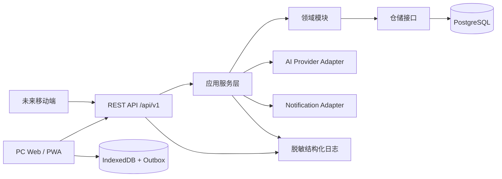

# Livefil 概要设计说明书

> 版本：v0.1  
> 日期：2026-09-15  
> 架构状态：已根据项目负责人确认的决策定型  
> 关联：[产品设计说明书](../04-product-design/产品设计说明书.md) · [SRS](../03-requirements/需求规格说明书_SRS.md)

## 1. 设计目标

本架构服务于第一阶段 PC Web/PWA，同时为未来移动端预留接口和数据能力。

核心目标：

- 低成本部署和维护。
- 业务模块清晰，避免后续后端重构。
- 支持云端账号、跨设备草稿和离线待同步操作。
- AI、通知和数据库可替换，不锁死业务层。
- 对金额、时区、同步、删除和权限提供可靠性保障。

## 2. 架构决策

| 决策 | 结论 |
|---|---|
| 架构风格 | API-first 模块化单体 |
| Web 框架 | Next.js + TypeScript |
| 接口 | REST/JSON，版本路径 `/api/v1`，OpenAPI 文档 |
| 数据库 | PostgreSQL |
| ORM/查询 | Drizzle，业务层不直接依赖 ORM |
| 校验 | Zod 或同等运行时 schema 校验 |
| 本地缓存 | IndexedDB，建议 Dexie 或等价封装 |
| 云端同步 | PostgreSQL 为云端主源，本地 outbox 待同步队列 |
| AI | Provider Adapter + 服务端代理 + 草稿确认 |
| 缓存 | P0 不引入 Redis，保留 CacheStore 扩展口 |
| 队列 | P0 不部署独立消息队列，异步需求通过可替换接口接入 |
| 部署 | 托管 Node/Docker + 托管 PostgreSQL |
| 监控 | 脱敏结构化日志，P0 不接第三方录屏/错误追踪 |

## 3. 总体架构



## 4. 分层设计

### 4.1 表现层

职责：

- 页面、布局、表单、状态展示。
- 用户交互和客户端缓存协调。
- 调用版本化 API，不直接访问数据库。

禁止：

- 在 React 组件中编写目标、排程、金额和同步规则。
- 直接拼接 API 请求的业务字段。
- 将 AI 返回结果未经校验写入正式状态。

### 4.2 API 适配层

职责：

- 路由、认证、参数解析、schema 校验。
- 调用应用服务。
- 统一错误响应、幂等键和请求 ID。

API 适配层不负责完整业务规则，也不直接处理复杂 SQL。

### 4.3 应用服务层

职责：

- 编排一个用例涉及的多个领域模块。
- 开启事务。
- 控制权限、幂等、同步和外部服务调用。
- 将领域结果转换为 API DTO。

示例：`CompleteExecutionLogUseCase` 可以同时更新执行记录、行动进度和复盘统计，但不把这些规则写入页面。

### 4.4 领域层

职责：

- 任务状态流转。
- 目标和行动规则。
- 时间块冲突判定。
- 例程和最低版本规则。
- 金额和开销规则。
- 同步版本和冲突规则。

领域层不依赖 Next.js、HTTP、PostgreSQL 或具体 AI 厂商。

### 4.5 基础设施层

职责：

- PostgreSQL/Drizzle 实现。
- 认证实现。
- IndexedDB 实现。
- AI 提供商实现。
- 通知、日志、备份和外部服务实现。

所有外部依赖通过接口接入，便于测试和替换。

## 5. 业务模块划分

| 模块 | 主要职责 | 核心数据 |
|---|---|---|
| identity | 用户、会话、模式和权限 | User, Session |
| life-areas | 生活领域 | LifeArea |
| tasks | 任务、收件箱、任务状态 | Task |
| goals | 目标、目标行动 | Goal, Action |
| scheduling | 时间块、固定事项、重复规则、冲突、今日聚合 | ScheduleBlock, FixedCommitment, Recurrence |
| routines | 例程和步骤 | Routine, RoutineStep |
| execution | 执行记录、最低版本、恢复 | ExecutionLog |
| expenses | 金额、分类、目标关联 | Expense, ExpenseCategory |
| reviews | 日复盘、周复盘和调整 | Review, ReviewAdjustment |
| notifications | 提醒规则和发送记录 | NotificationRule, NotificationDelivery |
| sync | 本地 outbox、版本、冲突 | SyncOperation, SyncConflict |
| ai | AI 草稿、调用和限额 | AiDraft, AiUsage |
| data-management | 导入、导出、删除和恢复 | ExportJob, DeletionRequest |

## 6. 部署架构

```text
开发环境
  ├─ Next.js 开发服务器
  ├─ 本地 PostgreSQL 或测试数据库
  └─ Mock AI Provider

预发布环境
  ├─ 托管 Node/Docker 应用
  ├─ 独立 PostgreSQL 数据库
  ├─ 测试账号和测试数据
  └─ 真实 API 的低额度或沙箱配置

生产/邀请测试环境
  ├─ 托管 Node/Docker 应用
  ├─ 托管 PostgreSQL + 连接池
  ├─ 独立密钥和环境变量
  ├─ 每日备份
  └─ 脱敏结构化日志
```

部署平台保持抽象，不把业务代码绑定到某一家服务商。应用应支持 Node.js 启动和 Docker 镜像两种方式。

## 7. 数据流

### 7.1 云端账号模式

```text
用户操作
  ↓
客户端状态更新（乐观或 pending）
  ↓
API 请求 + 幂等键
  ↓
认证/校验/权限
  ↓
应用服务 + 事务
  ↓
PostgreSQL
  ↓
返回版本和服务器时间
  ↓
客户端确认本地 outbox
```

### 7.2 断网模式

```text
用户操作
  ↓
IndexedDB 写入实体快照
  ↓
写入 Outbox 操作队列
  ↓
显示“待同步”
  ↓ 网络恢复
提交幂等操作
  ↓
服务端版本校验
  ├─成功：标记已同步
  └─冲突：生成冲突记录，提示用户
```

## 8. 关键架构约束

- 所有 API 采用 `/api/v1` 版本前缀。
- 每个写请求支持 `Idempotency-Key`。
- 所有时间存储 UTC，并保存用户时区语义。
- 所有金额存储整数分或 Decimal，不使用浮点数。
- 执行记录和开销优先追加式写入。
- 删除使用软删除/墓碑，后台清理必须有备份和确认。
- AI 只能产生草稿，不能越过用户确认直接写正式数据。
- 外部 API 调用必须有超时、限流、退避和降级。
- P0 不引入 Redis、微服务和独立消息队列。

## 9. 扩展路线

### 移动端

复用：

- `/api/v1` 接口。
- 认证和权限。
- 领域服务和数据模型。
- OpenAPI schema。
- 同步和冲突机制。

移动端只新增客户端表现层，不重新实现业务规则。

### 服务拆分

只有出现以下情况才考虑从模块化单体拆分独立服务：

- 某个模块需要独立扩缩容。
- 团队出现独立维护该模块的人力。
- AI、通知或同步任务显著影响主应用稳定性。
- 合规要求某类数据物理隔离。

## 10. 架构验收

- 页面不能直接访问数据库。
- 领域模块可在不启动 Next.js 的情况下运行单元测试。
- API 文档能描述所有 P0 接口。
- 本地 outbox 能处理重复提交和网络恢复。
- 任务、开销和执行记录有金额/时间/权限测试。
- 数据库迁移在测试环境完成备份和回滚演练。
- 应用可使用 Mock AI Provider 完成核心测试。
